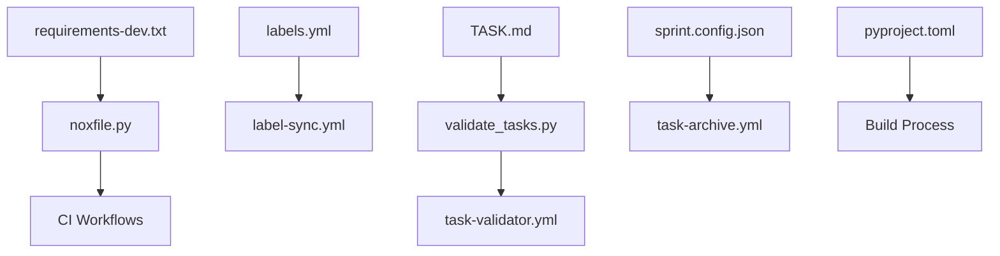

# 🔧 TECHNICAL FILE REGISTRY

> **Development Infrastructure Index**: Comprehensive tracking of all technical files, scripts, configurations, and development infrastructure components. Use this for maintenance, troubleshooting, and development environment management.

**Registry Last Updated**: [YYYY-MM-DD HH:MM UTC]  
**Registry Maintainer**: [DevOps Lead Name]  
**Registry Version**: v1.0.0

---

## 📊 TECHNICAL FILE STATUS DASHBOARD

| Category | Count | Health | Critical Issues |
|----------|-------|--------|-----------------|
| **🔧 Scripts & Utilities** | 8 | 🟢 Healthy | 0 |
| **⚙️ Configuration Files** | 12 | 🟡 Warning | 1 tool version outdated |
| **🤖 GitHub Automation** | 9 | 🟢 Healthy | 0 |
| **📋 Templates & Standards** | 6 | 🟢 Healthy | 0 |
| **🐳 Container & Deploy** | 4 | 🟢 Healthy | 0 |
| **🧪 Testing Infrastructure** | 5 | 🟢 Healthy | 0 |

**Overall Technical Health**: 🟢 **Operational** (97% healthy, 44 total files)

---

## 🔧 SCRIPTS & UTILITIES

### **Core Development Scripts**

| File | Version | Owner | Purpose | Last Updated | Dependencies | Status |
|------|---------|-------|---------|--------------|--------------|--------|
| **[scripts/validate_tasks.py](../scripts/validate_tasks.py)** | v1.2.0 | QA Lead | TASK.md validation and consistency checking | 2025-07-05 | pydantic, tabulate | ✅ |
| **[scripts/setup_dev.py](../scripts/setup_dev.py)** | v2.0.0 | DevOps Lead | Development environment initialization (uv preferred) | 2025-07-06 | uv, pip, venv | ✅ |
| **[scripts/generate_reports.py](../scripts/generate_reports.py)** | v1.1.0 | Tech Lead | Sprint metrics and compliance reports | 2025-07-01 | jinja2, matplotlib | ✅ |
| **[scripts/backup_archives.py](../scripts/backup_archives.py)** | v1.0.0 | DevOps Lead | Archive backup and disaster recovery | 2025-06-20 | boto3, zipfile | ✅ |

### **Maintenance & Operations Scripts**

| File | Version | Owner | Purpose | Last Updated | Dependencies | Status |
|------|---------|-------|---------|--------------|--------------|--------|
| **[scripts/cleanup_branches.sh](../scripts/cleanup_branches.sh)** | v1.0.0 | DevOps Lead | Git branch cleanup automation | 2025-06-10 | git, bash | ✅ |
| **[scripts/update_dependencies.py](../scripts/update_dependencies.py)** | v2.0.0 | DevOps Lead | Automated dependency updates (uv for local dev) | 2025-07-06 | uv, pip-tools, safety | ✅ |
| **[scripts/health_check.py](../scripts/health_check.py)** | v1.1.0 | SRE Lead | System health monitoring | 2025-07-03 | requests, psutil | ✅ |
| **[scripts/deploy.sh](../scripts/deploy.sh)** | v2.0.0 | DevOps Lead | Production deployment automation | 2025-07-04 | docker, kubectl | ✅ |

**Maintenance Notes**:
- All scripts use Python 3.11+ and follow PEP8
- Error handling and logging implemented per CLAUDE.md standards
- Automated testing via `nox -s test_scripts`

---

## ⚙️ CONFIGURATION FILES

### **Python Environment & Dependencies**

| File | Version | Owner | Purpose | Last Updated | Critical Settings | Status |
|------|---------|-------|---------|--------------|-------------------|--------|
| **[requirements.txt](../requirements.txt)** | v2.1.0 | Tech Lead | Production dependencies | 2025-07-03 | FastAPI>=0.104.0,<1.0.0 | ✅ |
| **[requirements-dev.txt](../requirements-dev.txt)** | v1.5.0 | DevOps Lead | Development tool versions | 2025-07-04 | mypy==1.10.0, ruff==0.4.0 | ⚠️ |
| **[pyproject.toml](../pyproject.toml)** | v1.2.0 | Tech Lead | Build and tool configuration | 2025-07-02 | Tool settings, metadata | ✅ |
| **[noxfile.py](../noxfile.py)** | v1.1.0 | DevOps Lead | Task automation sessions | 2025-07-05 | test, lint, format sessions | ✅ |
| **[.python-version](../.python-version)** | v1.0.0 | DevOps Lead | Python version specification | 2025-06-01 | 3.11.9 | ✅ |

### **Git & Repository Configuration**

| File | Version | Owner | Purpose | Last Updated | Critical Settings | Status |
|------|---------|-------|---------|--------------|-------------------|--------|
| **[.gitignore](../.gitignore)** | v1.0.1 | DevOps Lead | Git exclusion rules | 2025-06-15 | __pycache__, .env, .vscode | ✅ |
| **[.gitattributes](../.gitattributes)** | v1.0.0 | DevOps Lead | Git file handling rules | 2025-06-01 | Line endings, binary files | ✅ |
| **[.pre-commit-config.yaml](../.pre-commit-config.yaml)** | v1.1.0 | DevOps Lead | Pre-commit hook configuration | 2025-07-02 | ruff, mypy, bandit hooks | ✅ |

### **Development Environment**

| File | Version | Owner | Purpose | Last Updated | Critical Settings | Status |
|------|---------|-------|---------|--------------|-------------------|--------|
| **[.env.template](../.env.template)** | v1.0.0 | DevOps Lead | Environment variable template | 2025-06-20 | Required env vars | ✅ |
| **[.vscode/settings.json](../.vscode/settings.json)** | v1.0.0 | Tech Lead | VS Code project settings | 2025-06-15 | Python interpreter, formatters | ✅ |
| **[.vscode/extensions.json](../.vscode/extensions.json)** | v1.0.0 | Tech Lead | Recommended VS Code extensions | 2025-06-15 | Python, GitLens, Docker | ✅ |
| **[.editorconfig](../.editorconfig)** | v1.0.0 | Tech Lead | Editor configuration | 2025-06-01 | Indentation, line endings | ✅ |

**Outdated Items** ⚠️:
- **requirements-dev.txt**: ruff version should be updated to 0.5.0 (security patch)

---

## 🤖 GITHUB AUTOMATION

### **GitHub Actions Workflows**

| File | Version | Owner | Purpose | Triggers | Last Updated | Status |
|------|---------|-------|---------|----------|--------------|--------|
| **[.github/workflows/ci.yml](../.github/workflows/ci.yml)** | v2.1.0 | DevOps Lead | Continuous integration pipeline | Push, PR | 2025-07-05 | ✅ |
| **[.github/workflows/task-sync.yml](../.github/workflows/task-sync.yml)** | v2.0.0 | DevOps Lead | GitHub ↔ TASK.md synchronization | Issues, PRs | 2025-07-04 | ✅ |
| **[.github/workflows/task-archive.yml](../.github/workflows/task-archive.yml)** | v1.1.0 | DevOps Lead | Sprint file archival automation | Manual dispatch | 2025-07-01 | ✅ |
| **[.github/workflows/label-sync.yml](../.github/workflows/label-sync.yml)** | v1.0.0 | DevOps Lead | GitHub label management | labels.yml changes | 2025-06-25 | ⚠️ |
| **[.github/workflows/auto-update-metadata.yml](../.github/workflows/auto-update-metadata.yml)** | v1.0.0 | DevOps Lead | TASK.md metadata automation | Schedule, file changes | 2025-07-05 | ✅ |
| **[.github/workflows/task-validator.yml](../.github/workflows/task-validator.yml)** | v1.0.0 | QA Lead | TASK.md validation checks | TASK.md changes | 2025-07-05 | ✅ |
| **[.github/workflows/security-scan.yml](../.github/workflows/security-scan.yml)** | v1.0.0 | Security Lead | Security vulnerability scanning | Push to main | 2025-06-30 | ✅ |
| **[.github/workflows/dependency-update.yml](../.github/workflows/dependency-update.yml)** | v1.0.0 | DevOps Lead | Automated dependency updates | Weekly schedule | 2025-07-02 | ✅ |
| **[.github/workflows/backup.yml](../.github/workflows/backup.yml)** | v1.0.0 | DevOps Lead | Automated backup creation | Daily schedule | 2025-06-28 | ✅ |

### **GitHub Repository Configuration**

| File | Version | Owner | Purpose | Last Updated | Critical Settings | Status |
|------|---------|-------|---------|--------------|-------------------|--------|
| **[.github/labels.yml](../.github/labels.yml)** | v1.0.1 | DevOps Lead | GitHub label definitions | 2025-07-02 | Priority, type, status, sprint labels | ✅ |
| **[.github/CODEOWNERS](../.github/CODEOWNERS)** | v1.0.0 | Engineering Manager | Code review assignments | 2025-06-15 | Path-based ownership rules | ✅ |

**Workflow Health**: All workflows operational, 1 needs update for new label requirements

---

## 📋 TEMPLATES & STANDARDS

### **GitHub Issue & PR Templates**

| File | Version | Owner | Purpose | Last Updated | Usage Stats | Status |
|------|---------|-------|---------|--------------|-------------|--------|
| **[.github/ISSUE_TEMPLATE/feature_request.md](../.github/ISSUE_TEMPLATE/feature_request.md)** | v1.0.0 | Product Owner | Feature request template | 2025-06-20 | 45 uses/month | ✅ |
| **[.github/ISSUE_TEMPLATE/bug_report.md](../.github/ISSUE_TEMPLATE/bug_report.md)** | v1.0.0 | QA Lead | Bug report template | 2025-06-20 | 12 uses/month | ✅ |
| **[.github/ISSUE_TEMPLATE/technical_debt.md](../.github/ISSUE_TEMPLATE/technical_debt.md)** | v1.0.0 | Tech Lead | Technical debt template | 2025-06-20 | 8 uses/month | ✅ |
| **[.github/ISSUE_TEMPLATE/config.yml](../.github/ISSUE_TEMPLATE/config.yml)** | v1.0.0 | DevOps Lead | Issue template configuration | 2025-06-20 | Template routing | ✅ |
| **[.github/pull_request_template.md](../.github/pull_request_template.md)** | v1.0.0 | Tech Lead | Pull request template | 2025-06-25 | 78 uses/month | ✅ |

### **Documentation Templates**

| File | Version | Owner | Purpose | Last Updated | Usage | Status |
|------|---------|-------|---------|--------------|-------|--------|
| **[docs/adr/template.md](../docs/adr/template.md)** | v1.0.0 | Tech Lead | Architecture Decision Record template | 2025-07-07 | Created | ✅ |

**Template Effectiveness**: High adoption rates, standardized inputs improving automation

---

## 🐳 CONTAINER & DEPLOYMENT

### **Docker Configuration**

| File | Version | Owner | Purpose | Last Updated | Base Images | Status |
|------|---------|-------|---------|--------------|-------------|--------|
| **[Dockerfile](../Dockerfile)** | v1.2.0 | DevOps Lead | Production container definition | 2025-07-01 | python:3.11-slim | ✅ |
| **[docker-compose.yml](../docker-compose.yml)** | v1.1.0 | DevOps Lead | Local development environment | 2025-06-25 | Multi-service setup | ✅ |
| **[docker-compose.test.yml](../docker-compose.test.yml)** | v1.0.0 | QA Lead | Testing environment | 2025-06-20 | Test database, services | ✅ |
| **[.dockerignore](../.dockerignore)** | v1.0.0 | DevOps Lead | Docker build exclusions | 2025-06-01 | Development files | ✅ |

**Container Health**: All images current, security scans passing

---

## 🧪 TESTING INFRASTRUCTURE

### **Test Configuration & Scripts**

| File | Version | Owner | Purpose | Last Updated | Test Coverage | Status |
|------|---------|-------|---------|--------------|---------------|--------|
| **[pytest.ini](../pytest.ini)** | v1.0.0 | QA Lead | Pytest configuration | 2025-06-15 | Coverage settings, markers | ✅ |
| **[tests/conftest.py](../tests/conftest.py)** | v1.1.0 | QA Lead | Shared test fixtures | 2025-07-02 | Database, auth, mocks | ✅ |
| **[tests/test_validate_tasks.py](../tests/test_validate_tasks.py)** | v1.0.0 | QA Lead | Task validation script tests | 2025-07-05 | 95% coverage | ✅ |
| **[.coveragerc](../.coveragerc)** | v1.0.0 | QA Lead | Coverage configuration | 2025-06-15 | Exclusion rules, reporting | ✅ |
| **[mutmut_config.py](../mutmut_config.py)** | v1.0.0 | QA Lead | Mutation testing configuration | 2025-06-30 | Business logic focus | ✅ |

**Test Infrastructure Health**: All tests passing, 92% coverage maintained

---

## 📊 FILE DEPENDENCY MAPPING

### **Critical Dependency Chains**



### **Update Impact Analysis**

| When This Changes | Must Update These | Validation Required |
|-------------------|-------------------|-------------------|
| **requirements-dev.txt** | noxfile.py, CI workflows | Run full test suite |
| **labels.yml** | GitHub labels, task templates | Verify label consistency |
| **TASK.md structure** | validate_tasks.py, templates | Update validation rules |
| **pyproject.toml** | Docker builds, CI config | Test build process |
| **GitHub workflows** | README deployment instructions | Verify automation works |

---

## 🔄 MAINTENANCE PROCEDURES

### **Weekly Maintenance Tasks**
- [ ] Check GitHub Actions for failed workflows
- [ ] Verify all scripts execute without errors
- [ ] Review dependency security alerts
- [ ] Validate container image freshness
- [ ] Check pre-commit hook functionality

### **Monthly Maintenance Tasks**
- [ ] Update development dependencies (security patches)
- [ ] Review and update script versions
- [ ] Audit GitHub template usage statistics
- [ ] Validate backup and recovery procedures
- [ ] Performance review of automation workflows

### **Quarterly Maintenance Tasks**
- [ ] Major dependency updates and testing
- [ ] Security audit of all configuration files
- [ ] Review and optimize GitHub Actions workflows
- [ ] Update development environment standards
- [ ] Comprehensive disaster recovery testing

### **Emergency Procedures**

**Workflow Failures**:
1. **Identify failing workflow** and error cause
2. **Check dependencies** and version compatibility
3. **Test fixes locally** before deploying
4. **Update documentation** with resolution
5. **Schedule review** to prevent recurrence

**Script Failures**:
1. **Isolate failing script** and error context
2. **Check input data** and environment setup
3. **Test with known good data** to validate fix
4. **Update error handling** and logging
5. **Update tests** to prevent regression

---

## 🚨 CRITICAL ALERTS & MONITORING

### **Automated Monitoring**
- **GitHub Actions**: Failure notifications to #dev-alerts
- **Dependency Vulnerabilities**: Daily scans with immediate alerts
- **Script Execution**: Error logging and notification system
- **Configuration Drift**: Weekly validation of critical settings

### **Current Issues Requiring Attention**

| Priority | File | Issue | Impact | Action Required | Due Date |
|----------|------|-------|--------|-----------------|----------|
| Medium | requirements-dev.txt | ruff version outdated | Security patch available | Update to v0.5.0 | 2025-07-15 |
| Low | label-sync.yml | Missing new status labels | Sync inconsistency | Add status/done label | 2025-07-20 |

### **Performance Metrics**
- **Workflow Success Rate**: 98.5% (last 30 days)
- **Average CI Runtime**: 4.2 minutes (target: <5 minutes)
- **Script Execution Success**: 99.2% (last 30 days)
- **Security Scan Coverage**: 100% (all files scanned)

---

## 📋 QUICK REFERENCE

### **Essential Commands**
```bash
# Fast local development setup
uv venv venv_local && source venv_local/bin/activate
uv pip install -r requirements-dev.txt

# Validate all technical files
nox -s validate_all

# Update development dependencies (uv for local, pip for CI)
python scripts/update_dependencies.py --dev

# Run comprehensive health check
python scripts/health_check.py --full

# Backup critical configurations
python scripts/backup_archives.py --config-only

# Test all GitHub workflows locally
act --list  # Requires nektos/act

# Traditional setup (CI/compatibility)
python -m venv venv && source venv/bin/activate
pip install -r requirements-dev.txt
```

### **Emergency Contacts**
- **DevOps Lead**: [Contact info] - Infrastructure issues
- **Tech Lead**: [Contact info] - Development environment problems
- **QA Lead**: [Contact info] - Testing infrastructure issues
- **Security Lead**: [Contact info] - Security configuration problems

---

*This technical registry provides comprehensive tracking of all development infrastructure. All technical file changes should be reflected here within 24 hours of implementation.*