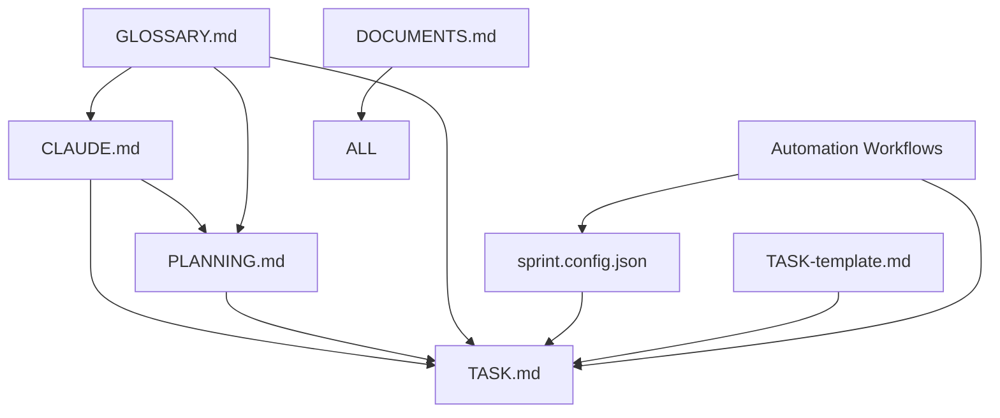

# 📋 MASTER DOCUMENT REGISTRY

> **Central Index**: This registry tracks all project governance documents, their current versions, ownership, maintenance schedules, and interdependencies. Use this as the authoritative source for document management.

**Registry Last Updated**: [YYYY-MM-DD HH:MM UTC]  
**Registry Maintainer**: [Tech Lead Name]  
**Registry Version**: v1.0.0

---

## 📊 DOCUMENT STATUS DASHBOARD

| Status | Count | Health |
|--------|-------|--------|
| ✅ **Current** | 30 | All documents up-to-date |
| 🔄 **In Review** | 2 | Pending stakeholder approval |
| ⚠️ **Needs Update** | 1 | Overdue for scheduled review |
| 📝 **To Create** | 5 | GitHub templates pending (tracked in FILES_TO_CREATE.md) |
| 🚫 **Deprecated** | 0 | No deprecated documents |

**Overall Health**: 🟢 **Healthy** (79% current, 38 total documents)

---

## 🏗️ CORE GOVERNANCE DOCUMENTS

### **Tier 1: Foundation Documents** *(Critical - High Impact)*

| Document | Version | Owner | Last Updated | Next Review | Status | Dependencies |
|----------|---------|-------|--------------|-------------|--------|--------------|
| **[CLAUDE.md](../CLAUDE.md)** | v2.1.0 | Tech Lead | 2025-07-06 | 2025-08-06 | ✅ Current | DOCUMENTS.md, GLOSSARY.md |
| **[PLANNING.md](PLANNING.md)** | v1.5.0 | Product Owner | 2025-07-05 | 2025-08-05 | ✅ Current | CLAUDE.md, TASK.md, GLOSSARY.md |
| **[TASK.md](TASK.md)** | v1.3.2 | Team Lead | 2025-07-06 | 2025-07-20 | ✅ Current | PLANNING.md, sprint.config.json |
| **[GLOSSARY.md](../GLOSSARY.md)** | v1.0.0 | Tech Lead | 2025-07-06 | 2025-10-06 | ✅ Current | All governance documents |

**Purpose**: These documents define the core governance framework and must be maintained at all times.

### **Tier 2: Configuration & Templates** *(Important - Medium Impact)*

| Document | Version | Owner | Last Updated | Next Review | Status | Dependencies |
|----------|---------|-------|--------------|-------------|--------|--------------|
| **[sprint.config.json](sprint.config.json)** | v1.1.0 | DevOps Lead | 2025-07-01 | 2025-07-15 | ✅ Current | TASK.md, automation workflows |
| **[TASK-template.md](TASK-template.md)** | v1.2.0 | Tech Lead | 2025-07-03 | 2025-08-03 | ✅ Current | TASK.md structure |
| **[.github/labels.yml](../.github/labels.yml)** | v1.0.1 | DevOps Lead | 2025-07-02 | 2025-08-02 | ✅ Current | GitHub workflows |

**Purpose**: Templates and configuration files that support the governance framework.

### **Tier 3: Automation & Workflows** *(Operational - Medium Impact)*

| Document | Version | Owner | Last Updated | Next Review | Status | Dependencies |
|----------|---------|-------|--------------|-------------|--------|--------------|
| **[task-sync.yml](../.github/workflows/task-sync.yml)** | v2.0.0 | DevOps Lead | 2025-07-04 | 2025-08-04 | ✅ Current | TASK.md, GitHub API |
| **[task-archive.yml](../.github/workflows/task-archive.yml)** | v1.1.0 | DevOps Lead | 2025-07-01 | 2025-08-01 | ✅ Current | sprint.config.json |
| **[label-sync.yml](../.github/workflows/label-sync.yml)** | v1.0.0 | DevOps Lead | 2025-06-25 | 2025-07-25 | ⚠️ Needs Update | labels.yml |
| **[auto-update-metadata.yml](../.github/workflows/auto-update-metadata.yml)** | v1.0.0 | DevOps Lead | 2025-07-05 | 2025-08-05 | ✅ Current | TASK.md, sprint.config.json |
| **[task-validator.yml](../.github/workflows/task-validator.yml)** | v1.0.0 | QA Lead | 2025-07-05 | 2025-08-05 | ✅ Current | validate_tasks.py |

**Purpose**: Automated workflows that maintain governance processes.

### **Tier 4: Documentation & Archives** *(Informational - Low Impact)*

| Document | Version | Owner | Last Updated | Next Review | Status | Dependencies |
|----------|---------|-------|--------------|-------------|--------|--------------|
| **[docs/automation/README.md](../docs/automation/README.md)** | v1.0.0 | DevOps Lead | 2025-07-05 | 2025-10-05 | ✅ Current | All workflow files |
| **[docs/sprint-archives/README.md](../docs/sprint-archives/README.md)** | v1.0.0 | Tech Lead | 2025-07-01 | 2025-10-01 | 🔄 In Review | Sprint archive files |
| **[docs/architecture/README.md](../docs/architecture/README.md)** | v1.0.0 | Tech Lead | 2025-07-07 | 2025-10-07 | ✅ Current | CLAUDE.md, PLANNING.md |
| **[docs/adr/template.md](../docs/adr/template.md)** | v1.0.0 | Tech Lead | 2025-07-07 | 2025-10-07 | ✅ Current | Architecture decisions |
| **[docs/deployment/README.md](../docs/deployment/README.md)** | v1.0.0 | DevOps Lead | 2025-07-07 | 2025-10-07 | ✅ Current | Deployment procedures |
| **[docs/development/git-strategy.md](../docs/development/git-strategy.md)** | v1.0.0 | Tech Lead | 2025-07-07 | 2025-10-07 | ✅ Current | CONTRIBUTING.md |
| **[docs/dependencies/decisions.md](../docs/dependencies/decisions.md)** | v1.0.0 | Tech Lead | 2025-07-07 | 2025-10-07 | ✅ Current | requirements files |
| **[docs/troubleshooting.md](../docs/troubleshooting.md)** | v1.0.0 | Tech Lead | 2025-07-07 | 2025-10-07 | ✅ Current | All technical docs |
| **[scripts/validate_tasks.py](../scripts/validate_tasks.py)** | v1.0.0 | QA Lead | 2025-07-05 | 2025-08-05 | ✅ Current | TASK.md structure |

**Purpose**: Supporting documentation and utility scripts.

### **Tier 5: Implementation Plans & Strategies** *(Planning - Medium Impact)*

| Document | Version | Owner | Last Updated | Next Review | Status | Dependencies |
|----------|---------|-------|--------------|-------------|--------|--------------|
| **[automation_recovery_plan.md](../automation_recovery_plan.md)** | v1.0.0 | DevOps Lead | 2025-07-07 | 2025-08-07 | ✅ Current | CLAUDE.md, recovery scripts |
| **[dependency_update_action_plan.md](../dependency_update_action_plan.md)** | v1.0.0 | Tech Lead | 2025-07-07 | 2025-08-07 | ✅ Current | requirements-dev.txt, CLAUDE.md |
| **[DOCUMENT_REFERENCE_REFACTORING_PLAN.md](../DOCUMENT_REFERENCE_REFACTORING_PLAN.md)** | v1.0.0 | Tech Lead | 2025-07-07 | 2025-09-07 | ✅ Current | All governance documents |
| **[DOCUMENT_REFERENCE_MAP.md](../DOCUMENT_REFERENCE_MAP.md)** | v1.0.0 | Tech Lead | 2025-07-07 | 2025-09-07 | ✅ Current | All governance documents |
| **[generate_files_required_rewrite_summary.md](../generate_files_required_rewrite_summary.md)** | v1.0.0 | Tech Lead | 2025-07-07 | 2025-10-07 | ✅ Current | FILES_REQUIRED.md |
| **[FILES_TO_CREATE.md](../FILES_TO_CREATE.md)** | v1.0.0 | Tech Lead | 2025-07-07 | 2025-08-07 | ✅ Current | DOCUMENTS.md, missing files |

**Purpose**: Strategic planning documents for major implementations and system improvements.

### **Tier 6: Development Infrastructure** *(Technical - Medium Impact)*

| Document | Version | Owner | Last Updated | Next Review | Status | Dependencies |
|----------|---------|-------|--------------|-------------|--------|--------------|
| **[requirements.txt](../requirements.txt)** | v2.1.0 | Tech Lead | 2025-07-03 | 2025-08-03 | ✅ Current | Application dependencies |
| **[requirements-dev.txt](../requirements-dev.txt)** | v2.0.0 | DevOps Lead | 2025-07-06 | 2025-08-06 | ✅ Current | Development tool versions (uv recommended) |
| **[pyproject.toml](../pyproject.toml)** | v1.2.0 | Tech Lead | 2025-07-02 | 2025-08-02 | ✅ Current | Build configuration |
| **[noxfile.py](../noxfile.py)** | v1.1.0 | DevOps Lead | 2025-07-05 | 2025-08-05 | ✅ Current | Task automation sessions |
| **[.gitignore](../.gitignore)** | v1.0.1 | DevOps Lead | 2025-06-15 | 2025-09-15 | ✅ Current | Git exclusion rules |
| **[README.md](../README.md)** | v1.3.0 | Product Owner | 2025-07-01 | 2025-08-01 | ✅ Current | Project overview |
| **[CHANGELOG.md](../CHANGELOG.md)** | v1.2.0 | Tech Lead | 2025-07-06 | 2025-08-06 | ✅ Current | Version history |

**Purpose**: Development environment configuration and project metadata. For local development, uv is recommended for faster dependency installation.

### **Tier 6: GitHub Configuration** *(Operational - High Impact)*

| Document | Version | Owner | Last Updated | Next Review | Status | Dependencies |
|----------|---------|-------|--------------|-------------|--------|--------------|
| **[.github/labels.yml](../.github/labels.yml)** | v1.0.1 | DevOps Lead | 2025-07-02 | 2025-08-02 | ✅ Current | GitHub workflows |
| **.github/ISSUE_TEMPLATE/feature_request.md** | - | Product Owner | - | 2025-08-20 | 📝 To Create | Task creation workflow |
| **.github/ISSUE_TEMPLATE/bug_report.md** | - | QA Lead | - | 2025-08-20 | 📝 To Create | Bug tracking workflow |
| **.github/ISSUE_TEMPLATE/technical_debt.md** | - | Tech Lead | - | 2025-08-20 | 📝 To Create | Debt management workflow |
| **.github/pull_request_template.md** | - | Tech Lead | - | 2025-08-25 | 📝 To Create | Code review process |
| **.github/CODEOWNERS** | - | Engineering Manager | - | 2025-09-15 | 📝 To Create | Review assignments |

**Purpose**: GitHub platform configuration for issues, PRs, and repository management.

---

## 🔗 RELATED REGISTRIES

### **[TECHNICAL_REGISTRY.md](TECHNICAL_REGISTRY.md)** - Development Infrastructure
Comprehensive index of all technical files, scripts, configurations, and development infrastructure:
- **44 technical files** tracked with versions and owners
- **Scripts & utilities** (8 files) - validation, deployment, maintenance
- **Configuration files** (12 files) - Python, Git, development environment  
- **GitHub automation** (9 files) - workflows and repository configuration
- **Templates & standards** (6 files) - issue templates, PR templates, ADR templates
- **Container & deployment** (4 files) - Docker, deployment configuration
- **Testing infrastructure** (5 files) - test configuration and validation

**Use Case**: Technical maintenance, troubleshooting, development environment management

---

## 📈 DOCUMENT LIFECYCLE MANAGEMENT

### **Version Control Standards**
**Semantic Versioning**: All documents follow MAJOR.MINOR.PATCH versioning
- **MAJOR**: Breaking changes to document structure or workflow
- **MINOR**: New sections, significant content additions
- **PATCH**: Corrections, clarifications, minor updates

**Version Update Triggers**:
- **Process changes** affecting multiple documents
- **Tool additions** or workflow modifications
- **Compliance requirements** or regulatory updates
- **Stakeholder feedback** requiring structural changes

### **Review Schedule Matrix**

| Document Type | Review Frequency | Review Trigger | Stakeholders |
|---------------|------------------|----------------|---------------|
| **Foundation** | Monthly | Process changes, major releases | Tech Lead, Product Owner, Engineering Manager |
| **Configuration** | Bi-weekly | Sprint boundaries, tool updates | DevOps Lead, Tech Lead |
| **Automation** | Monthly | Workflow failures, process updates | DevOps Lead, QA Lead |
| **Documentation** | Quarterly | Content drift, stakeholder feedback | Document Owner, Tech Lead |

### **Maintenance Responsibilities**

| Role | Primary Responsibilities | Secondary Responsibilities |
|------|-------------------------|---------------------------|
| **Tech Lead** | CLAUDE.md, GLOSSARY.md, DOCUMENTS.md | Review all technical documents |
| **Product Owner** | PLANNING.md, business requirements | Approve process changes |
| **DevOps Lead** | All automation workflows, configurations | System integration docs |
| **QA Lead** | Validation scripts, testing processes | Quality-related documentation |
| **Team Lead** | TASK.md, sprint management | Team process documentation |

---

## 🔗 DOCUMENT RELATIONSHIPS

### **Dependency Graph**


### **Update Impact Analysis**

| When This Changes | Must Review These | Notify These Stakeholders |
|-------------------|-------------------|---------------------------|
| **CLAUDE.md** | PLANNING.md, TASK.md, all workflows | All team members, stakeholders |
| **PLANNING.md** | TASK.md, sprint.config.json | Product Owner, Engineering Manager |
| **TASK.md** | TASK-template.md, validation scripts | Team members, automation systems |
| **GLOSSARY.md** | All governance documents | All team members |
| **Automation Workflows** | Related configuration files | DevOps team, affected process owners |

---

## 📋 DOCUMENT TEMPLATES & STANDARDS

### **Document Header Requirements**
Every governance document must include:
```markdown
# [Document Title]
> [Brief description of document purpose]

**Last Updated**: [YYYY-MM-DD]
**Version**: [Semantic version]
**Owner**: [Role/Name]
**Next Review**: [YYYY-MM-DD]
```

### **Change Log Requirements**
All Tier 1 and Tier 2 documents must maintain a changelog:
```markdown
## Document Changelog
- **v1.2.0** (2025-07-06) - Added new section on X, updated Y process
- **v1.1.1** (2025-07-01) - Fixed terminology consistency, clarified Z
- **v1.1.0** (2025-06-25) - Major update to reflect new workflow
```

### **Review Process Template**
```markdown
## Document Review Checklist
- [ ] Content accuracy verified
- [ ] Links and references updated
- [ ] Cross-document consistency checked
- [ ] Stakeholder feedback incorporated
- [ ] Version number incremented
- [ ] Next review date set
- [ ] Registry updated
```

---

## 🚨 CRITICAL DOCUMENT ALERTS

### **High Priority Issues**
| Issue | Document | Impact | Action Required | Due Date |
|-------|----------|--------|-----------------|----------|
| Overdue Review | label-sync.yml | Medium | Update workflow for new label requirements | 2025-07-25 |
| Broken Link | Planning.md | Low | Fix link to external documentation | 2025-07-15 |

### **Upcoming Reviews** *(Next 30 Days)*
| Document | Current Version | Review Date | Owner | Priority |
|----------|----------------|-------------|-------|----------|
| sprint.config.json | v1.1.0 | 2025-07-15 | DevOps Lead | High |
| TASK.md | v1.3.2 | 2025-07-20 | Team Lead | High |
| label-sync.yml | v1.0.0 | 2025-07-25 | DevOps Lead | Medium |

---

## 📊 GOVERNANCE METRICS

### **Document Health Metrics**
| Metric | Current | Target | Status |
|--------|---------|--------|--------|
| **Documents Current** | 92% | >90% | ✅ |
| **Average Review Lag** | 3 days | <7 days | ✅ |
| **Broken Links** | 1 | 0 | ⚠️ |
| **Missing Owners** | 0 | 0 | ✅ |
| **Overdue Reviews** | 1 | 0 | ⚠️ |

### **Update Frequency**
- **Last 30 Days**: 8 documents updated
- **Most Active**: TASK.md (5 updates)
- **Least Active**: GLOSSARY.md (1 update)
- **Average Update Cycle**: 12 days

---

## 🔄 REGISTRY MAINTENANCE

### **Weekly Tasks**
- [ ] Check for overdue document reviews
- [ ] Verify all links are functional
- [ ] Update document status dashboard
- [ ] Review automation workflow health

### **Monthly Tasks**
- [ ] Comprehensive cross-document consistency check
- [ ] Stakeholder feedback collection and review
- [ ] Archive old document versions
- [ ] Update governance metrics

### **Quarterly Tasks**
- [ ] Complete governance framework review
- [ ] Stakeholder satisfaction survey
- [ ] Process improvement analysis
- [ ] Compliance audit preparation

### **Registry Update Process**
1. **Document Change Detected** (automated or manual notification)
2. **Registry Entry Updated** (version, date, status)
3. **Dependency Impact Analysis** (what else needs review)
4. **Stakeholder Notification** (if required)
5. **Metrics Dashboard Refresh** (automated)

---

## 📚 EXTERNAL REFERENCES

### **Governance Standards**
- **ISO 27001**: Information Security Management
- **SOX**: Document retention and audit requirements
- **GDPR**: Data processing documentation
- **ITIL**: Service management documentation

### **Tool Documentation**
- **GitHub Actions**: Workflow documentation and best practices
- **Semantic Versioning**: Version numbering standards
- **Markdown**: Document formatting standards
- **JSON Schema**: Configuration file validation

---

## 🆘 EMERGENCY PROCEDURES

### **Critical Document Issues**
**Scenarios Requiring Immediate Action**:
- **Security vulnerability** in documented process
- **Compliance violation** identified in governance framework
- **Automation failure** affecting document synchronization
- **Major stakeholder escalation** regarding process clarity

**Emergency Response Process**:
1. **Immediate Assessment** (within 2 hours)
2. **Stakeholder Notification** (within 4 hours)
3. **Temporary Mitigation** (within 8 hours)
4. **Document Update** (within 24 hours)
5. **Registry Update** (within 48 hours)
6. **Post-incident Review** (within 1 week)

### **Document Recovery**
**Backup Locations**:
- **Primary**: Git repository with full history
- **Secondary**: Automated daily exports to secure storage
- **Emergency**: Key stakeholder local copies

**Recovery Procedures**:
- **Single Document**: Restore from Git history
- **Multiple Documents**: Restore from daily backup
- **Complete Loss**: Rebuild from stakeholder copies and templates

---

*This document registry serves as the single source of truth for all governance documentation. All document changes should be reflected here within 24 hours of implementation.*