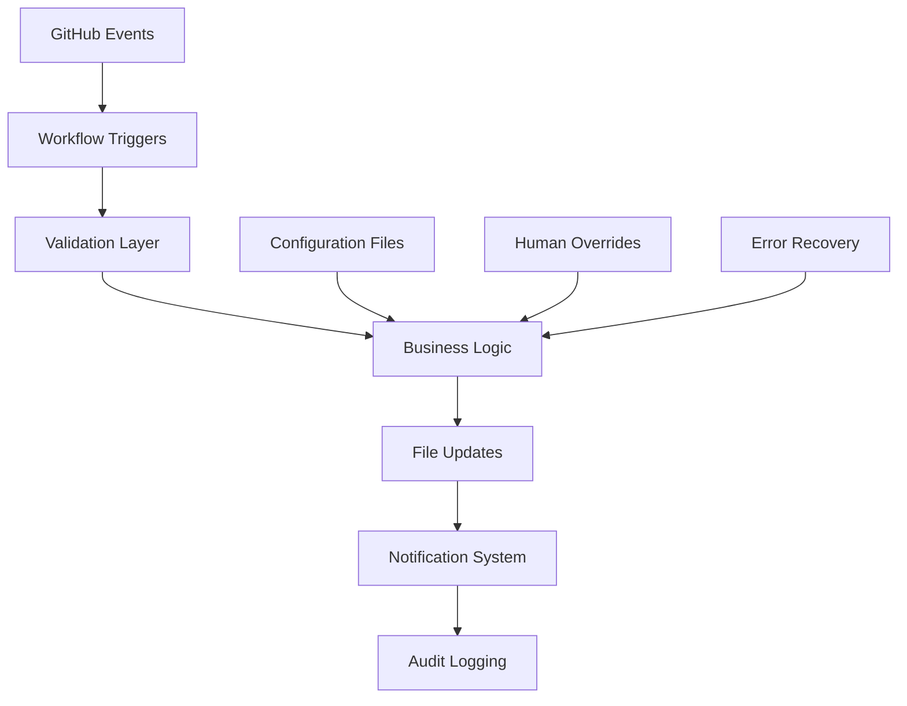

# 📋 PROJECT PLANNING - [Project Name]

> **READ THIS FIRST**: This document provides essential context for understanding the project's architecture, goals, constraints, and development approach. All contributors and AI assistants should review this before starting work.

**Last Updated**: [YYYY-MM-DD]  
**Project Status**: [Planning/Active Development/Maintenance/Deprecated]  
**Current Version**: [Semantic Version]

<details>
<summary><strong>📑 Table of Contents</strong></summary>

- [🚦 Project Health Scorecard](#-project-health-scorecard)
- [🎯 Project Overview](#-project-overview)
- [🏗️ Architecture & Technology](#-architecture--technology)
- [📁 Project Structure](#-project-structure)
- [🔧 Development Standards](#-development-standards)
- [🚨 Constraints & Requirements](#-constraints--requirements)
- [🧪 Testing Strategy](#-testing-strategy)
- [🔄 Development Workflow](#-development-workflow)
- [📊 Monitoring & Observability](#-monitoring--observability)
- [🤝 Team & Collaboration](#-team--collaboration)
- [📚 References & Resources](#-references--resources)
- [📌 Decision Log](#-decision-log-optional)
- [📘 Glossary](#-glossary)
- [🗂️ Sprint Tracking](#-sprint-tracking-optional)
- [🔄 Document Maintenance](#-document-maintenance)

</details>

## 🚦 PROJECT HEALTH SCORECARD
*Updated monthly during sprint retrospectives*

| Metric | Owner | Target | Current | Status | Notes |
|------------------------|---------|------------|---------|--------|-------|
| Code Coverage | QA Team | >90% | 92% | ✅ | Mutation testing at 85% |
| Bug Escape Rate | Dev Team | <2/month | 1 | ✅ | Zero critical bugs this month |
| Deployment Frequency | DevOps | >1/week | 2.1/week | ✅ | Automated pipeline working well |
| MTTR (Mean Time to Recovery) | SRE Team | <6 hours | 4.2h | ✅ | Improved monitoring helping |
| Technical Debt Items | Tech Lead | <5 open | 7 | ⚠️ | 3 scheduled for next sprint |
| AI Code Quality Score | AI/Human | >85% | 88% | ✅ | AI contributions passing all gates |
| Security Scan Results | Security | 0 critical | 0 | ✅ | Last scan: [YYYY-MM-DD] |
| Performance SLA Compliance | Backend | >99% | 99.2% | ✅ | API response times stable |

**Health Trend**: ⬆️ Improving (previous month: 6/8 green)
**Next Review**: [YYYY-MM-DD]

---

## 🎯 PROJECT OVERVIEW

### Vision & Goals
**Primary Objective**: [One-sentence description of what this project accomplishes]

**Success Criteria**:
- [ ] [Measurable goal 1 - e.g., "Handle 1000+ concurrent users"]
- [ ] [Measurable goal 2 - e.g., "API response time < 200ms"]
- [ ] [Business goal - e.g., "Reduce manual processing by 80%"]

**Target Users**:
- **Primary**: [Who will use this daily - e.g., "Internal customer service team"]
- **Secondary**: [Who benefits indirectly - e.g., "External API consumers"]
- **Stakeholders**: [Who cares about outcomes - e.g., "Product team, compliance team"]

### Project Scope
**In Scope**:
- [Feature/capability 1]
- [Feature/capability 2]
- [Integration requirement]

**Explicitly Out of Scope**:
- [What we're NOT building - prevents scope creep]
- [Deferred features for future versions]

---

## 🏗️ ARCHITECTURE & TECHNOLOGY

### Technology Stack
**Core Technologies** (with rationale):
```
Backend:     Python 3.11+ (team expertise, extensive libraries)
Framework:   FastAPI (performance, auto-docs, type safety)
Database:    PostgreSQL (ACID compliance, JSON support)
Cache:       Redis (session management, job queues)
Queue:       Celery + Redis (background processing)
Testing:     Pytest + Coverage (comprehensive test suite)
```

**Infrastructure**:
- **Development**: Docker Compose (local consistency)
- **Staging**: [Cloud provider/setup]
- **Production**: [Cloud provider/setup with redundancy]
- **CI/CD**: [GitHub Actions/GitLab CI/Jenkins]
- **Monitoring**: [Prometheus + Grafana/DataDog/New Relic]

### System Architecture
**Architecture Style**: [Layered / Hexagonal / Event-Driven / Microservice / Monolith / Clean Architecture]

**High-Level Design**:
```
[Frontend] → [API Gateway] → [Application Services] → [Database]
                ↓
           [Background Workers] → [External APIs]
                ↓
           [Message Queue/Cache]
```

**Key Components**:
- **API Layer**: REST endpoints with OpenAPI documentation
- **Service Layer**: Business logic and orchestration
- **Data Layer**: Repository pattern with SQLAlchemy
- **Background Processing**: Async task handling
- **External Integrations**: [List key external services]

**Data Flow**:
1. [User request flow]
2. [Background job flow]
3. [Data synchronization flow]

---

## 📁 PROJECT STRUCTURE

### Directory Organization
```
project-name/
├── src/
│   ├── domain/           # Core business logic (entities, value objects)
│   ├── services/         # Application services (orchestration)
│   ├── api/             # FastAPI routes and schemas
│   │   ├── routes/      # Endpoint definitions
│   │   └── schemas/     # Pydantic models
│   ├── database/        # SQLAlchemy models and migrations
│   │   ├── models/      # Database models
│   │   └── migrations/  # Alembic migration files
│   ├── workers/         # Celery background tasks
│   ├── integrations/    # External service clients
│   ├── utils/           # Shared utilities
│   └── config/          # Configuration management
├── tests/               # Test suite (mirrors src/ structure)
│   ├── unit/           # Fast, isolated tests
│   ├── integration/    # Service interaction tests
│   └── e2e/            # End-to-end scenarios
├── docs/               # Documentation
│   ├── api/            # API documentation
│   ├── architecture/   # System design docs
│   └── deployment/     # Ops and deployment guides
├── scripts/            # Deployment and utility scripts
├── docker/             # Docker configurations
└── .github/            # CI/CD workflows
```

### Naming Conventions
**Files & Directories**:
- `snake_case` for Python files and directories
- `kebab-case` for Docker and script files
- `PascalCase` for classes and exceptions

**Code Elements**:
- **Classes**: `UserService`, `PaymentProcessor`
- **Functions**: `calculate_risk_score()`, `send_notification()`
- **Constants**: `MAX_RETRY_ATTEMPTS`, `DEFAULT_TIMEOUT`
- **Environment Variables**: `DATABASE_URL`, `API_SECRET_KEY`

---

## 🔧 DEVELOPMENT STANDARDS

### SOLID Principles (Architectural Foundation)
All architecture and refactoring decisions should adhere to the SOLID principles:
- **S - Single Responsibility**: Each class/module has one reason to change
- **O - Open/Closed**: Software entities open for extension, closed for modification  
- **L - Liskov Substitution**: Derived classes must be substitutable for base classes
- **I - Interface Segregation**: Clients shouldn't depend on methods they don't use
- **D - Dependency Inversion**: Depend on abstractions, not concretions

Applied consistently across services, domain models, and infrastructure modules. See [Bulletproof CLAUDE Guidelines](CLAUDE.md) for detailed examples and enforcement rules.

### Code Quality Enforcement Tools
**Automated Quality Gates**:
- **Type Checking**: mypy (strict mode) - zero type violations allowed
- **Linting**: ruff (PEP8 + custom rules) - automatic formatting and error detection  
- **Testing**: pytest + pytest-cov - 90%+ coverage requirement
- **Mutation Testing**: mutmut - 80%+ score for business logic modules
- **Security Scanning**: bandit + safety - zero critical vulnerabilities
- **Complexity Analysis**: radon - cyclomatic complexity ≤ 10 per function
- **Dependency Health**: pip-audit - monitor for vulnerable packages

All tools integrated into pre-commit hooks and CI/CD pipeline with zero-tolerance failure policy.

### AI Code Assistance Policy
- **AI-generated code must pass all quality gates** (tests, typing, lint, security)
- **AI suggestions should follow SOLID** and project-specific patterns defined in this document
- **All AI changes must be peer-reviewed** unless contributor is marked @trusted
- **AI assistants must read this PLANNING.md first** before contributing to project
- See **AI BEHAVIOR RULES** in [Bulletproof CLAUDE Guidelines](CLAUDE.md) for detailed requirements

### AI Contributor Scope
**Core Workflow Documents**:
- 📋 **[TASK.md](planning/TASK.md)** - Active task tracking and specifications
- 🤖 **[CLAUDE.md](CLAUDE.md)** - AI behavior rules and development standards

**AI Assistants Are REQUIRED To**:
- ✅ **Create test files for ALL Python modules** - no exceptions
- ✅ **Verify 90%+ test coverage** before marking tasks complete
- ✅ **Write tests using CLAUDE.md naming conventions**
- ✅ **Include happy path, edge cases, and failure scenarios**
- ✅ **Run test suite and confirm passing** before completion

**AI Assistants Are Authorized To**:
- ✅ **Draft new features** from [TASK.md](planning/TASK.md) following established patterns
- ✅ **Refactor code** for SOLID principles, DRY compliance, and maintainability
- ✅ **Write comprehensive tests** with proper coverage and edge cases
- ✅ **Update documentation** to reflect code changes
- ✅ **Fix bugs** following established debugging patterns
- ✅ **Optimize performance** within existing architectural boundaries

**AI Assistants CANNOT Mark Tasks Complete Without**:
- ❌ **Corresponding test files** for all Python modules
- ❌ **Verified test coverage report** showing 90%+ coverage
- ❌ **Passing test suite execution** confirmation

**AI Assistants Must NOT**:
- ❌ **Make architectural decisions** without explicit human review and approval
- ❌ **Add third-party dependencies** without team consensus via RFC process
- ❌ **Modify security configurations** or authentication mechanisms
- ❌ **Change database schemas** without migration review
- ❌ **Deploy to production** or modify CI/CD pipelines
- ❌ **Make breaking API changes** without stakeholder approval

**Human Maintainers Are Responsible For**:
- 🔒 **All production deployments** and release coordination
- 🛡️ **Security reviews** and vulnerability patch triage
- 🏗️ **Final architecture approval** and design decisions
- 👥 **Team coordination** and stakeholder communication

**AI Assistants May Support These Activities But Not Own Them**

---

## 🤖 AUTOMATION DESIGN OVERVIEW

> **Strategic Automation**: The project implements comprehensive automation to reduce manual overhead, ensure consistency, and maintain compliance while preserving human oversight and decision-making authority.

### Automation Philosophy
**Human-Centric Automation**: All automation serves to amplify human productivity and decision-making rather than replace human judgment. Critical decisions, security changes, and architectural choices remain under human control.

**Fail-Safe Design**: Automation systems include human override capabilities, error recovery procedures, and graceful degradation when systems fail.

**Audit-Compliant**: All automated actions maintain complete audit trails for regulatory compliance and retrospective analysis.

### Core Automation Systems

#### **Task Management Automation**
**Bidirectional GitHub Integration**: Seamless synchronization between GitHub issues/PRs and TASK.md files.

**Key Features**:
- **Real-time Status Sync**: Task status updates automatically when GitHub issues/PRs change state
- **Review Status Tracking**: PR reviews automatically update task review status (✔️/🔍/⚠️/🚀)
- **Label Synchronization**: GitHub labels mirror TASK.md priorities and types
- **Task ID Linkage**: `task_id: T-XXX` references create automatic bidirectional connections

**Benefits**: Eliminates manual sync overhead, ensures consistency, provides single source of truth

#### **Sprint File Management**
**Automated Sprint Transitions**: Complete sprint boundary management with archival and new sprint initialization.

**Process Flow**:
1. **Archive Trigger**: Manual workflow dispatch or scheduled sprint end
2. **File Versioning**: Current TASK.md archived as immutable compliance record
3. **New Sprint Creation**: Fresh TASK.md generated from template with updated sprint metadata
4. **Archive Indexing**: Automatic update of sprint archive navigation

**Compliance Value**: Immutable audit trails, regulatory compliance, historical analysis capability

#### **Quality Assurance Automation**
**Continuous Quality Gates**: Automated enforcement of CLAUDE.md standards without human intervention.

**Validation Pipeline**:
- **Task Validation**: Automated TASK.md format and consistency checking
- **Code Quality**: Type checking, linting, formatting, security scanning
- **Test Coverage**: Automated coverage reporting and mutation testing
- **Documentation**: Link validation and cross-reference checking

**Standards Enforcement**: Zero-tolerance automation ensures consistent adherence to governance standards

#### **Metadata & Metrics Automation**
**Real-time Dashboard Updates**: Automatic calculation and display of project health metrics.

**Automated Metrics**:
- **Sprint Progress**: Task completion rates and burndown calculations
- **Quality Indicators**: Code coverage, test success rates, security scan results
- **Process Metrics**: Review cycle times, deployment frequency, incident response
- **Health Scoring**: Overall project health based on multiple indicators

**Executive Value**: Real-time visibility without manual reporting overhead

### Automation Architecture

#### **Technology Stack**
```yaml
Platform: GitHub Actions
Languages: Python 3.11+, Bash, YAML
Key Libraries:
  - Validation: pydantic, tabulate
  - GitHub API: @octokit/rest
  - Configuration: PyYAML, jq
  - Task Execution: nox, pytest
  - Security: bandit, safety
```

#### **Workflow Architecture**


#### **Configuration Management**
**Centralized Configuration**: All automation settings managed through version-controlled configuration files.

**Key Configuration Sources**:
- **sprint.config.json**: Sprint metadata and parameters
- **labels.yml**: GitHub label definitions and synchronization rules
- **workflow files**: GitHub Actions automation logic
- **validation schemas**: TASK.md and document structure requirements

**Change Management**: All configuration changes require peer review and validation testing

### Implementation Phases

#### **Phase 1: Foundation** *(Completed)*
- ✅ **Core Documentation**: CLAUDE.md, PLANNING.md, TASK.md framework
- ✅ **Basic Automation**: GitHub Actions CI/CD pipeline
- ✅ **Quality Gates**: Automated testing and validation

#### **Phase 2: Task Integration** *(Completed)*
- ✅ **GitHub Sync**: Bidirectional task status synchronization
- ✅ **Label Management**: Automated label creation and maintenance
- ✅ **File Validation**: TASK.md structure and consistency checking

#### **Phase 3: Sprint Management** *(Completed)*
- ✅ **Automated Archival**: Sprint file rotation and versioning
- ✅ **Metadata Updates**: Real-time dashboard and metrics calculation
- ✅ **Configuration Management**: Centralized sprint parameter control

#### **Phase 4: Advanced Features** *(Completed)*
- ✅ **Error Recovery**: Comprehensive failure handling and human override procedures
- ✅ **Audit Compliance**: Complete change tracking and regulatory documentation
- ✅ **Performance Monitoring**: Automation health metrics and alerting

### Human Override Framework

#### **Override Authority Levels**
```
Emergency (Any Senior) → Process (Tech/Product Lead) → Automation (Task Owner)
```

#### **Override Documentation**
**Required for All Overrides**:
- **Justification**: Business or technical reason for override
- **Risk Assessment**: Identified risks and mitigation strategies
- **Expiration Date**: When override should be reviewed/removed
- **Learning Integration**: How override improves future automation

#### **Override Types**
- **Emergency Override**: Production incidents requiring immediate manual intervention
- **Process Override**: Justified deviations from standard workflows
- **Automation Override**: Manual resolution when automation conflicts with human judgment

### Performance & Reliability

#### **Current Performance Metrics**
| Metric | Target | Current | Status |
|--------|--------|---------|--------|
| **Workflow Success Rate** | >95% | 98.5% | ✅ |
| **Sync Lag Time** | <5 min | 2.3 min | ✅ |
| **Quality Gate Runtime** | <5 min | 4.2 min | ✅ |
| **Override Frequency** | <5/month | 2/month | ✅ |

#### **Reliability Features**
- **Idempotent Operations**: All automation can be safely re-run
- **Error Recovery**: Automatic retry with exponential backoff
- **Circuit Breakers**: Prevent cascade failures in external integrations
- **Monitoring & Alerting**: Proactive detection of automation issues

### Security & Compliance

#### **Security Measures**
- **Least Privilege**: Automation runs with minimal required permissions
- **Secret Management**: All secrets stored in encrypted GitHub secrets
- **Audit Logging**: Complete trail of all automated actions
- **Input Validation**: All user inputs sanitized and validated

#### **Compliance Features**
- **Immutable Archives**: Audit-ready historical records
- **Change Attribution**: Clear tracking of human vs. automated changes
- **Regulatory Alignment**: SOX, ISO 27001, GDPR compliance support
- **Access Controls**: Role-based permissions for automation management

### Future Roadmap

#### **Short-term Enhancements** *(Next 3 months)*
- **Enhanced Metrics**: More sophisticated project health indicators
- **Smart Notifications**: Intelligent alerting based on context and priority
- **Integration Expansion**: Additional external service integrations

#### **Medium-term Vision** *(6-12 months)*
- **Predictive Analytics**: Trend analysis and proactive issue identification
- **AI-Enhanced Automation**: Machine learning for improved decision support
- **Cross-Project Integration**: Shared automation across multiple projects

#### **Long-term Strategy** *(1-2 years)*
- **Self-Healing Systems**: Automated detection and resolution of common issues
- **Adaptive Workflows**: Automation that learns and improves from team patterns
- **Enterprise Integration**: Organization-wide governance automation platform

### Documentation & Support

#### **Automation Documentation**
- **[Task Automation Implementation Plan](docs/automation/task_automation_plan.md)**: Complete technical implementation guide
- **[TECHNICAL_REGISTRY.md](planning/TECHNICAL_REGISTRY.md)**: Comprehensive file and script inventory
- **[Workflow Troubleshooting Guide](docs/automation/troubleshooting.md)**: Common issues and resolution procedures
- **[Override Procedures](docs/governance/overrides.md)**: Human intervention protocols

#### **Training & Support**
- **Team Training**: Regular sessions on automation capabilities and override procedures
- **Documentation Maintenance**: Continuous updates as automation evolves
- **Performance Reviews**: Monthly automation effectiveness assessment
- **Stakeholder Communication**: Regular updates on automation value and improvements

This automation design provides the strategic foundation for efficient, compliant, and human-controlled project governance at enterprise scale.

### Project-Specific Patterns
**Service Layer Pattern**:
```python
# Services orchestrate domain logic and external calls
class UserRegistrationService:
    def __init__(self, user_repo: UserRepository, email_service: EmailService):
        self.user_repo = user_repo
        self.email_service = email_service
    
    def register_user(self, user_data: UserRegistrationData) -> User:
        # Validation, business logic, external calls
        pass
```

**Repository Pattern**:
```python
# Data access abstraction
class UserRepository(Protocol):
    def save(self, user: User) -> User: ...
    def find_by_email(self, email: str) -> Optional[User]: ...
```

**Configuration Management**:
```python
# Centralized config with environment-specific overrides
class Settings(BaseSettings):
    database_url: str
    redis_url: str
    api_secret_key: SecretStr
    
    class Config:
        env_file = ".env"
```

### API Design Standards
**REST Conventions**:
- `GET /users` - List users (with pagination)
- `POST /users` - Create user
- `GET /users/{id}` - Get specific user
- `PUT /users/{id}` - Update user (full replacement)
- `PATCH /users/{id}` - Partial update
- `DELETE /users/{id}` - Remove user

**Response Standards**:
```python
# Success response
{
    "data": {...},
    "meta": {"total": 100, "page": 1, "per_page": 20}
}

# Error response
{
    "error": {
        "code": "VALIDATION_ERROR",
        "message": "Invalid input data",
        "details": [{"field": "email", "issue": "Invalid format"}]
    }
}
```

**Error Handling Middleware**: All API errors automatically follow standard format via global FastAPI exception handler. See `src/api/middleware/error_handler.py` for implementation details and custom error types.

### Performance Requirements
**API Response Times**:
- Simple queries: < 100ms (95th percentile)
- Complex queries: < 500ms (95th percentile)
- Background jobs: < 5 minutes (99th percentile)

**Scalability Targets**:
- Concurrent users: 1,000+
- Requests per second: 500+
- Database connections: 50 max pool

---

## 🚨 CONSTRAINTS & REQUIREMENTS

### Performance Requirements

### Technical Constraints
**Performance**:
- API must handle 500 RPS sustained load
- Database queries optimized for < 100ms response
- Memory usage < 512MB per worker process

**Security** (OWASP ASVS Level 2):
- All data encrypted in transit (TLS 1.3+)
- Authentication required for all endpoints
- Input validation on all user data
- Audit logging for sensitive operations

**Compliance**:
- [GDPR/CCPA data privacy requirements]
- [Industry-specific regulations]
- [Data retention policies]

### Business Constraints
**Timeline**: [Project deadline and key milestones]
**Budget**: [Resource limitations that affect technical choices]
**Team**: [Team size and skill level considerations]
**Integration**: [Must work with existing systems X, Y, Z]

### Known Technical Debt
**Current Issues**:
- [ ] 🛠️ **Legacy system integration complexity** - *Refactor planned for Q2*
- [ ] 🧨 **User search performance bottleneck** - *Sprint 3 optimization scheduled*
- [ ] 🔧 **Test coverage gaps in payment module** - *Sprint 3 priority*

**Mitigation Strategy**:
- Weekly tech debt review in sprint planning
- 20% of sprint capacity allocated to debt reduction
- Critical issues get immediate attention

### Key Risks
**Technical Risks**:
- [ ] 🚨 **Lack of existing integration documentation** (Service X) - *Mitigation: Allocate discovery sprint*
- [ ] ⚡ **Rate limiting from third-party API** (Service Y) - *Mitigation: Implement circuit breaker + caching*
- [ ] 📊 **Limited observability in staging** - *Mitigation: Enhanced logging deployment planned*
- [ ] 🗃️ **Database migration complexity** - *Mitigation: Blue-green deployment strategy*

**Business Risks**:
- [ ] 📋 **Changing compliance requirements** - *Mitigation: Monthly compliance review*
- [ ] 👥 **Team knowledge concentration** - *Mitigation: Documentation and cross-training*

---

## 🧪 TESTING STRATEGY

### Test Types & Coverage
**Unit Tests** (90%+ coverage):
- All business logic in `domain/` and `services/`
- Database repository implementations
- API request/response handling

**Integration Tests**:
- Database interactions (using test database)
- External API integrations (using mocks)
- Background job processing

**End-to-End Tests**:
- Critical user journeys
- API workflow scenarios
- Error handling and recovery

### Test Environment Setup
**Local Development**:
```bash
# Quick setup with uv (recommended for speed)
uv venv venv_local && source venv_local/bin/activate
uv pip install -r requirements-dev.txt
docker-compose -f docker-compose.test.yml up -d
nox -s tests

# Traditional setup (CI/compatibility)
python -m venv venv && source venv/bin/activate
pip install -r requirements-dev.txt
docker-compose -f docker-compose.test.yml up -d
nox -s tests
```

**CI/CD Pipeline**:
1. Unit tests (parallel execution)
2. Integration tests (with test DB)
3. E2E tests (against staging environment)
4. Performance tests (load testing key endpoints)

### Testing Service-Level Objectives
**Development Workflow SLAs**:
- **Pull request review cycle**: < 24 hours (business days)
- **All tests execution time**: < 5 minutes (local and CI)
- **Mutation testing score**: > 80% for business logic modules
- **Flaky test remediation**: Quarantined within 1 sprint, fixed within 2 sprints
- **Test data setup**: < 30 seconds for integration test suite
- **Coverage report generation**: < 2 minutes

**Mutation Testing Protocol**:
- **Tracking**: Results stored in `tests/mutants/{module_name}.json` per module
- **Thresholds**: Business logic (80%+), utilities (70%+), integrations (60%+)
- **Quarantine Policy**: Tests failing >3 times in 48 hours are auto-quarantined
- **Reintroduction**: Quarantined tests reviewed weekly, fixed tests re-enabled after 2 consecutive passes

**Quality Gates**:
- Zero failing tests before merge
- No reduction in coverage percentage
- All security scans pass
- Performance tests within acceptable thresholds

### Story Points Estimation Framework
**Purpose**: Story points provide relative effort estimation independent of individual developer speed or calendar time.

**Fibonacci-Based Scale**:
| Points | Complexity | Time Range | Description | Examples |
|--------|------------|------------|-------------|----------|
| **1** | Trivial | < 2 hours | Simple config changes, documentation fixes | Update README, change environment variable |
| **2** | Small | 2-4 hours | Minor features, simple bug fixes | Add validation rule, fix CSS styling |
| **3** | Moderate | 4-8 hours (≤1 day) | Standard features, typical bug fixes | Create API endpoint, implement form validation |
| **5** | Complex | 1-3 days | Multi-step features, complex integrations | User authentication flow, third-party API integration |
| **8** | Large | 3-5 days | Significant features, major refactoring | Payment processing system, complex data migration |
| **13** | Epic | 1-2 weeks | Major features, architectural changes | New user dashboard, microservice extraction |
| **21** | Epic+ | > 2 weeks | Large initiatives requiring breakdown | Complete redesign, new product module |

**Estimation Guidelines**:
- **Relative Sizing**: Compare against previously completed tasks
- **Include All Work**: Development + testing + documentation + review time
- **Account for Unknowns**: Add points for research, learning, or uncertainty
- **Team Calibration**: Regularly review completed tasks to align estimation

**Epic Breakdown Rules**:
- **13+ Points**: Consider breaking into smaller tasks
- **21+ Points**: Must be broken down into 3-8 point sub-tasks
- **Epic Tracking**: Use separate `epics/E-XXX.md` files for large initiatives

**Velocity Calculation**:
- **Sprint Velocity**: Total points completed in a sprint
- **Team Velocity**: Average points per sprint over last 3-6 sprints
- **Capacity Planning**: Use velocity to plan future sprint commitments

---

## 🔄 DEVELOPMENT WORKFLOW

### Git Strategy
**Recommended Branch Model**: GitHub Flow (lightweight, continuous deployment friendly)
- `main` - Production-ready code, protected branch
- `feature/feature-name` - Feature development branches
- `hotfix/issue-description` - Critical production fixes

**Alternative Models**:
- **GitFlow**: For projects with scheduled releases and longer development cycles
- **Custom**: For complex multi-service environments

**Detailed Strategy**: See [docs/development/git-strategy.md](docs/development/git-strategy.md) for branch protection rules, merge policies, and release procedures.

### Repository Structure
```
project-name/
├── .github/
│   ├── workflows/           # CI/CD pipeline definitions
│   ├── ISSUE_TEMPLATE/      # Bug reports, feature requests
│   └── pull_request_template.md
├── docs/                    # All documentation
│   ├── api/                # API documentation
│   ├── architecture/       # System design docs
│   ├── deployment/         # Ops and deployment guides
│   └── sprint-summaries/   # Historical sprint logs
├── planning/               # Project governance documents
│   ├── PLANNING.md         # This document
│   ├── TASK.md            # Active task tracking
│   └── ADRs/              # Architecture Decision Records
├── scripts/               # Deployment and utility scripts
│   ├── deploy/            # Deployment automation
│   ├── maintenance/       # Database maintenance, backups
│   └── development/       # Dev environment setup
├── docker/                # Docker configurations
│   ├── development/       # Local development setup
│   ├── staging/          # Staging environment
│   └── production/       # Production deployment
├── src/                   # Application source code
│   ├── domain/           # Core business logic
│   ├── services/         # Application services
│   ├── api/             # FastAPI routes and schemas
│   ├── database/        # SQLAlchemy models and migrations
│   ├── workers/         # Celery background tasks
│   ├── integrations/    # External service clients
│   ├── utils/           # Shared utilities
│   └── config/          # Configuration management
│       ├── settings.py  # Pydantic configuration schema
│       ├── secrets/     # Vault integration or secret loader
│       └── env/         # Environment detection and overrides
└── tests/               # Test suite (mirrors src/ structure)
    ├── unit/           # Fast, isolated tests
    ├── integration/    # Service interaction tests
    ├── e2e/            # End-to-end scenarios
    └── fixtures/       # Test data and mocks
```

### Release Process
**Version Strategy**: Semantic Versioning (MAJOR.MINOR.PATCH)
- **MAJOR**: Breaking API changes
- **MINOR**: New features, backward compatible
- **PATCH**: Bug fixes, security updates

**Deployment Targets**:
- **Development**: Auto-deploy from `develop` branch (continuous deployment)
- **Staging**: Manual promotion from `develop` (feature testing and QA)
- **Production**: Tagged release from `main` branch (controlled release)

**Release Checklist**:
- [ ] All tests pass
- [ ] Security scan clean
- [ ] Performance benchmarks meet targets
- [ ] Documentation updated
- [ ] CHANGELOG.md updated
- [ ] Staging deployment successful
- [ ] Migration scripts tested

**Environment Promotion Flow**:
```
feature/branch → develop → staging → main → production
     ↓              ↓         ↓        ↓         ↓
   CI tests    Auto-deploy  Manual   Tag    Production
                           promotion release   deploy
```

---

## 📊 MONITORING & OBSERVABILITY

### Key Metrics
**Application Metrics**:
- Request latency (p50, p95, p99)
- Error rates by endpoint
- Active user sessions
- Background job queue depth

**Business Metrics**:
- [Domain-specific KPIs]
- User engagement metrics
- Feature adoption rates

**Infrastructure Metrics**:
- CPU and memory utilization
- Database connection pool usage
- Cache hit/miss ratios

### Alerting Strategy
**Critical Alerts** (immediate notification):
- Service down or unresponsive
- Error rate > 5%
- Database connection failures

**Warning Alerts** (business hours):
- Response time > 500ms
- Queue depth > 100 jobs
- Memory usage > 80%

---

## 🤝 TEAM & COLLABORATION

### Roles & Responsibilities
**Tech Lead**: [Name] - Architecture decisions, code reviews
**Senior Developers**: [Names] - Feature development, mentoring
**Junior Developers**: [Names] - Feature development, testing
**DevOps**: [Name] - Infrastructure, deployments, monitoring

### Communication Channels
- **Daily standups**: [Time/Platform]
- **Sprint planning**: [Schedule]
- **Architecture discussions**: [Async/Sync process]
- **Code reviews**: [GitHub/GitLab PRs with required approvals]

### Decision Making
**Architecture Decisions**: Tech lead approval required
**Library Additions**: Team consensus via RFC process
**Breaking Changes**: Stakeholder approval required

### Escalation & Manual Review Process
**Human Override Authority**: While automation streamlines task management, human judgment remains paramount for complex decisions, disputes, and exceptional circumstances.

#### **Escalation Triggers**
**Automatic Escalation** (system-initiated):
- **Automation Conflicts**: When GitHub sync fails or produces inconsistent states
- **Quality Gate Failures**: Repeated CI/CD failures for same task (>3 attempts)
- **Dependency Deadlocks**: Circular dependencies or unresolvable blocking chains
- **Security Violations**: Tasks flagged by security scanning or compliance checks
- **SLA Breaches**: Tasks exceeding defined time limits (review >48h, implementation >2 weeks)

**Manual Escalation** (human-initiated):
- **Task Disputes**: Disagreements on priority, scope, or assignment
- **Resource Conflicts**: Multiple team members claiming same task
- **Scope Creep**: Tasks growing beyond original story point estimates
- **Technical Disagreements**: Architecture or implementation approach conflicts
- **Process Violations**: Deviations from CLAUDE.md standards requiring justification

#### **Escalation Hierarchy**
**Level 1 - Team Lead Review** (Target Resolution: 24 hours):
- **Authority**: Task reassignment, priority changes, scope clarification
- **Scope**: Individual task conflicts, minor process deviations
- **Process**: Create issue with `escalation: team-lead` label
- **Outcomes**: Task modification, team discussion, process clarification

**Level 2 - Technical Lead Review** (Target Resolution: 48 hours):
- **Authority**: Architecture decisions, tool/library approvals, quality standard exceptions
- **Scope**: Technical disputes, architecture conflicts, major refactoring decisions
- **Process**: Create issue with `escalation: tech-lead` label, include technical context
- **Outcomes**: Architecture decision record (ADR), technical standard updates

**Level 3 - Product Owner Review** (Target Resolution: 72 hours):
- **Authority**: Scope changes, priority overrides, resource allocation, timeline adjustments
- **Scope**: Business impact decisions, customer-facing changes, sprint goal conflicts
- **Process**: Create issue with `escalation: product-owner` label, include business impact
- **Outcomes**: Sprint scope modification, stakeholder communication, timeline adjustment

**Level 4 - Engineering Manager Review** (Target Resolution: 1 week):
- **Authority**: Process changes, team structure, cross-team coordination, vendor decisions
- **Scope**: Systemic issues, team conflicts, major process deviations, budget impacts
- **Process**: Create issue with `escalation: engineering-manager` label, include full context
- **Outcomes**: Process updates, team reorganization, vendor evaluation, budget requests

#### **Manual Override Procedures**
**Emergency Override** (for critical production issues):
```markdown
**Trigger**: Production outage, security breach, data corruption
**Authority**: Any senior team member (Tech Lead, Engineering Manager, Product Owner)
**Process**:
1. Create emergency task with ID format: URGENT-XXX
2. Skip normal approval workflows
3. Implement immediate fix
4. Document in emergency-overrides.md
5. Schedule post-incident review within 48 hours
**Documentation**: All emergency decisions documented in incident reports
```

**Process Override** (for justified standard deviations):
```markdown
**Trigger**: Unique circumstances requiring deviation from CLAUDE.md standards
**Authority**: Tech Lead (technical) or Product Owner (business)
**Process**:
1. Create override request with business/technical justification
2. Document risk assessment and mitigation strategies
3. Set expiration date for override (max 1 sprint)
4. Update process-overrides.md with rationale
5. Schedule review in next retrospective
**Examples**: Legacy system integration, customer demo requirements, compliance deadlines
```

**Automation Override** (for AI/automation conflicts):
```markdown
**Trigger**: AI recommendations conflict with human judgment or business needs
**Authority**: Task owner with team lead approval
**Process**:
1. Document AI recommendation and reasoning for override
2. Update TASK.md manually with override notation
3. Add automation-overrides.md entry with learning points
4. Flag for AI behavior review and potential training updates
**Learning**: Override patterns used to improve AI behavior rules
```

#### **Dispute Resolution Framework**
**Task Assignment Disputes**:
1. **Initial Resolution**: Team discussion in daily standup
2. **Mediation**: Team lead facilitates resolution meeting
3. **Decision**: Tech lead makes final assignment decision
4. **Documentation**: Record decision rationale in task notes

**Priority Conflicts**:
1. **Business Impact Assessment**: Product owner evaluates customer/business impact
2. **Technical Risk Assessment**: Tech lead evaluates technical complexity and dependencies
3. **Resource Analysis**: Engineering manager reviews team capacity and skills
4. **Final Decision**: Joint decision by product owner and tech lead
5. **Communication**: Stakeholder notification of priority changes

**Scope Disagreements**:
1. **Requirements Clarification**: Product owner clarifies acceptance criteria
2. **Technical Feasibility**: Tech lead assesses implementation complexity
3. **Story Pointing**: Team re-estimates with new understanding
4. **Decision**: Proceed, split task, or defer to future sprint
5. **Documentation**: Update task description and acceptance criteria

#### **Override Documentation Requirements**
**Override Log Entry Format**:
```markdown
**Override ID**: OVR-YYYY-MM-DD-XXX
**Date**: [ISO timestamp]
**Type**: [Emergency/Process/Automation]
**Authorizer**: [Name and role]
**Task(s) Affected**: [T-XXX, T-YYY]
**Justification**: [Business/technical reason]
**Risk Assessment**: [Identified risks and mitigations]
**Expiration**: [When override expires]
**Review Date**: [When to reassess]
**Outcome**: [Results and lessons learned]
```

**Compliance Requirements**:
- **All overrides logged** in `docs/governance/overrides.md`
- **Monthly override review** in retrospectives
- **Pattern analysis** for process improvement opportunities
- **Audit trail** for regulatory compliance

#### **Learning & Process Improvement**
**Override Pattern Analysis**:
- **Monthly Review**: Analyze override frequency and types
- **Root Cause Analysis**: Identify systemic issues causing overrides
- **Process Updates**: Modify standards based on override learnings
- **Training Needs**: Update team training based on common conflicts

**Continuous Improvement**:
- **Retrospective Discussion**: Include governance effectiveness in sprint retrospectives
- **Process Metrics**: Track escalation frequency, resolution time, team satisfaction
- **Standard Evolution**: Regular updates to CLAUDE.md based on real-world experience
- **Automation Refinement**: Improve AI behavior based on override patterns

This escalation framework ensures that human judgment remains central to project governance while maintaining the efficiency benefits of automation and AI assistance.

---

## 📚 REFERENCES & RESOURCES

### Documentation Links
- [API Documentation](link-to-swagger/openapi)
- [Database Schema](link-to-schema-docs)
- [Deployment Guide](docs/deployment/README.md)
- [Troubleshooting Guide](docs/troubleshooting.md)

### Architecture Decision Records (ADRs)
All significant architectural changes must be proposed as an ADR using the `docs/adr/` template. Each ADR should be:
- **Reviewed** by at least one senior developer or tech lead before implementation
- **Linked** in relevant pull requests that implement the decision
- **Assigned** a unique ID (ADR-001, ADR-002, etc.) and summarized in CHANGELOG.md when merged
- **Status tracked**: Proposed → Accepted/Rejected → Implemented/Superseded

**ADR Template**: Use `docs/adr/template.md` for consistency across all architectural decisions.

### External Dependencies
- [Service A Documentation](external-link)
- [Service B API Reference](external-link)
- [Compliance Requirements](internal-link)

### Learning Resources
- [Domain Knowledge Base](internal-wiki)
- [Team Coding Standards](link-to-standards)
- [Architecture Decision Records](docs/adr/)

---

## 📌 DECISION LOG (Optional)
*Track key project decisions - technical and business - with rationale for future reference*

| Date | Decision | Owner | Reason | Impact |
|------|----------|-------|--------|--------|
| 2025-07-01 | Dropped real-time chat support | Product Lead | Not aligned with MVP goals, complexity vs value | -3 weeks dev time |
| 2025-07-03 | Adopted FastAPI over Flask | Tech Lead | Type-safety, async support, auto-docs | +2 weeks learning curve |
| 2025-07-05 | Team size reduced to 4 devs | Engineering Manager | Budget constraints Q3 | Scope reduction needed |
| 2025-07-10 | Postponed mobile app to v2.0 | Product Lead | Web MVP validation first | Focus on core features |

**Decision Categories**:
- **Technical**: Architecture, tools, frameworks, infrastructure
- **Product**: Features, scope, user experience
- **Process**: Team structure, workflow, methodology
- **Business**: Budget, timeline, compliance, partnerships

---

## 📘 GLOSSARY

**Technical Terms**:
- **ADR**: Architecture Decision Record - documented design decisions with rationale
- **API**: Application Programming Interface - contract for software communication
- **CI/CD**: Continuous Integration / Continuous Deployment - automated development pipeline
- **DDD**: Domain-Driven Design - software design approach focused on business domain
- **DRY**: Don't Repeat Yourself - principle of reducing code duplication
- **MTTR**: Mean Time to Recovery - average time to restore service after failure
- **RPS**: Requests Per Second - measure of API throughput capacity
- **SLA**: Service-Level Agreement - commitment to specific performance standards
- **SOLID**: Software design principles (Single responsibility, Open/closed, Liskov substitution, Interface segregation, Dependency inversion)

**Business Terms**:
- **Sprint**: Time-boxed development iteration (typically 1-2 weeks)
- **Velocity**: Amount of work completed per sprint (measured in story points)
- **Technical Debt**: Code that needs refactoring for long-term maintainability
- **Stakeholder**: Person or team with interest in project outcomes

**Quality Metrics**:
- **Code Coverage**: Percentage of code executed during tests
- **Mutation Score**: Percentage of code mutations detected by tests
- **Cyclomatic Complexity**: Measure of code path complexity

---

## 🗂️ SPRINT TRACKING (Optional)

*Use this section to log sprint outcomes and learnings. Update after each sprint retrospective.*

### Sprint [Number] - [YYYY-MM-DD to YYYY-MM-DD]

**Completed**:
- [ ] [Feature A] - Live in staging, user testing in progress
- [ ] [Refactor B] - Merged to develop, 15% performance improvement measured
- [ ] [Bug Fix C] - Resolved critical auth issue, deployed to production

**Blockers Encountered**:
- [ ] [Service Y rate limiting] - Pending vendor feedback on quota increase
- [ ] [Database migration delay] - Compatibility issue found, workaround implemented
- [ ] [Third-party integration] - API documentation outdated, reverse-engineering required

**Lessons Learned**:
- **Performance**: Offloading cache logic improved API latency by 40%
- **Testing**: Mutation testing caught 3 critical bugs that unit tests missed
- **Architecture**: Service layer separation made feature development 25% faster
- **Process**: Daily async standups worked better than video calls for this sprint

**Metrics This Sprint**:
- Velocity: [Story points completed]
- Bug escape rate: [Bugs found in production]
- Code coverage: [Percentage achieved]
- Deployment frequency: [Number of deployments]

**Action Items for Next Sprint**:
- [ ] Investigate Service Y alternatives - [Owner] - [Due Date]
- [ ] Implement circuit breaker pattern - [Owner] - [Due Date]
- [ ] Schedule knowledge sharing session on new patterns - [Owner] - [Due Date]

---

*Previous sprint summaries archived in `docs/sprint-summaries/`*

---

## 🔄 DOCUMENT MAINTENANCE

**Review Schedule**: Monthly review in sprint retrospectives
**Update Triggers**: 
- Major architecture changes
- New technology adoptions
- Significant constraint changes
- Post-incident learnings

**Owner**: [Tech Lead Name]
**Last Reviewed**: [YYYY-MM-DD]
**Next Review**: [YYYY-MM-DD]

---

*This document serves as the project's source of truth. When in doubt, refer back to these guidelines and update them as the project evolves.*